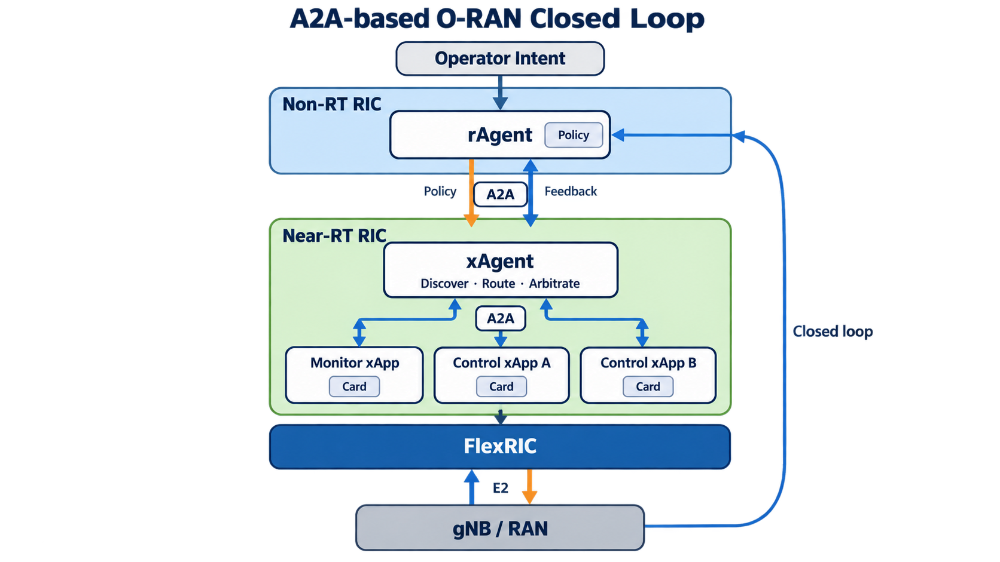

# FlexRIC A2A Minimal Prototype

This repository provides a minimal working prototype that connects FlexRIC's `nearRT-RIC`, built-in gNB emulator, and a Python xApp to an rAgent/xAgent workflow.



```text
gNB emulator --E2/MAC indication--> nearRT-RIC --> FlexRIC Python xApp
                                                       |
                         rAgent <--> xAgent <-----------+
                                          |
                              E2 MAC control (action=42)
```

## Running the Prototype

On Ubuntu 22.04, the setup requires `cmake`, `gcc/g++`, `swig`, `libsctp-dev`, `libpcre2-dev`, and `python3-dev`. The setup script uses a public FlexRIC mirror on GitHub, so no GitHub login or SSH key is required.

```bash
./scripts/setup_flexric.sh
./scripts/run_flexric_demo.sh
```

To run the demo, perform an automated smoke test, and exit:

```bash
./scripts/run_flexric_demo.sh --smoke
```

To run the 30-trial evaluation:

```bash
./scripts/run_30_experiments.sh
```

Direct REST/A2A latency, success rate, E2 indication latency, synthetic PRB values before and after control, and Agent Card lookup time for 1/10/50 cards are saved as CSV, JSON, and Markdown files under `artifacts/experiment-results/<timestamp>/`.

A run is considered successful when the xApp reports `e2_nodes >= 1`, `indications > 0`, `controls_sent >= 1`, and `last_control_success = true`. Runtime logs are stored under `artifacts/flexric-demo/`.

## Implementation Scope

- Uses FlexRIC E2AP v2.03 and the MAC service model
- Receives actual E2 indications from the built-in gNB emulator
- Invokes the FlexRIC xApp when the `prb_usage > 0.70` policy condition is met
- Sends MAC control action `42` to the E2 node and returns execution feedback
- Supports an immediate deterministic fallback without a GPU or LLM

`prb_usage` is a demonstration metric obtained by normalizing the FlexRIC emulator's `dl_aggr_prb` value (0–1023) to the range 0–1. It must be replaced with the target equipment's PRB calculation when integrating a real base station.

Control action `42` is a minimal message acknowledged by the emulator through FlexRIC's custom MAC service model. After an E2 control round trip, the emulator changes synthetic PRB, throughput, BSR-based queue-delay, and retransmission proxy metrics for five seconds to make the closed-loop effect measurable. This is not real wireless scheduler control. A real-base-station deployment must replace it with E2SM-RC or scheduler control supported by the target RAN.

## Final Evaluation

The following command runs the complete evaluation: an automatic closed loop driven by E2 indications, a Rule/LLM comparison using 30 registered actions and 30 open-vocabulary hold-out expressions, Agent Card scalability, conflict mitigation between two xApps running as separate processes, and QoS proxy episodes.

```bash
./scripts/run_final_experiments.sh
```

If no OpenAI-compatible LLM server is available at `127.0.0.1:8000`, the script launches `Qwen/Qwen2.5-1.5B-Instruct` locally with `vllm`. The first run requires an approximately 3.1 GB model download. Results are saved under `artifacts/final-experiment-results/<timestamp>/` and include:

- `FINAL_EXPERIMENT_RESULTS.md`: final summary tables and interpretation boundaries
- `core_results_dashboard.png`, `core_results_dashboard.pdf`: overview of the primary results
- `llm_performance_tradeoff.*`, `multi_xapp_conflict_performance.*`: detailed LLM and conflict-mitigation figures
- `qos_episode_effects.*`, `qos_tradeoff_relationship.*`: QoS effects and metric relationships
- `final_evaluation.png`, `final_evaluation.pdf`: six-panel evaluation figure
- `summary.json`: aggregate results
- `*.csv`: raw measurements from individual trials
- Per-component runtime logs

The QoS results are synthetic proxy metrics produced by the built-in gNB emulator in response to a custom action; they are not measurements of real Mbps or end-to-end latency. The 1–100 Agent Card scalability experiment uses a mock registry.

## Repository Layout

- `ragent/`, `xagent/`: policy generation and delivery, Agent Card discovery, routing, and conflict resolution
- `flexric_xapp/`, `xapp_monitor/`: FlexRIC E2 integration and state reporting
- `common/`: A2A messages and shared data schemas
- `experiments/`: repeated evaluation and plotting code
- `scripts/`: FlexRIC setup, demo, and final-evaluation automation
- `results/`: system model and primary report figures
- `artifacts/final-experiment-results/20260921T090629Z/`: published raw data, summaries, and detailed figures from the final run

Virtual environments, downloaded and built FlexRIC files, runtime logs, and intermediate experiments are not included in the repository. Running `scripts/setup_flexric.sh` downloads the pinned FlexRIC commit, applies the required patch, and reconstructs the local execution environment.
